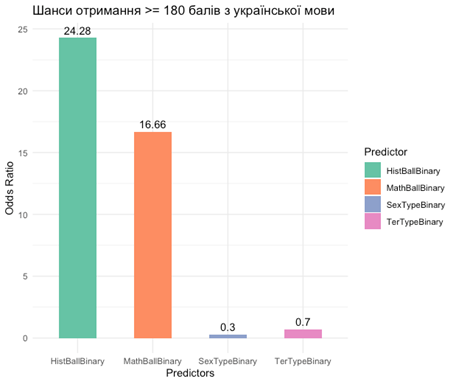
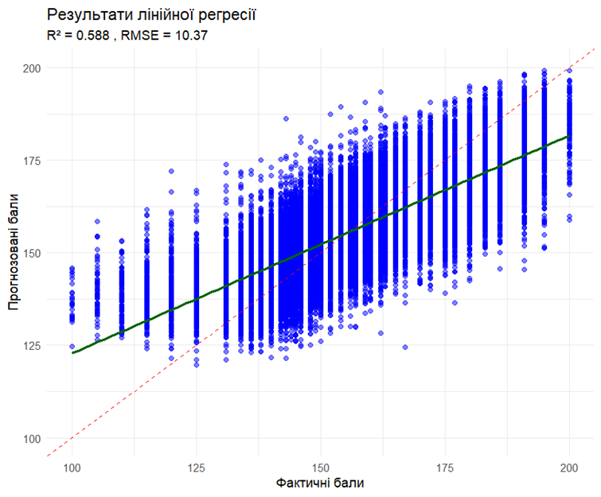
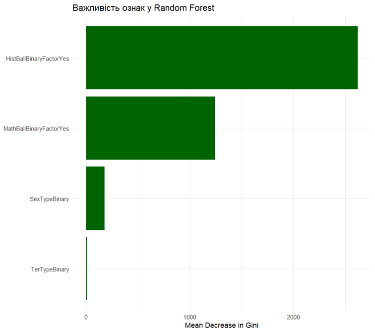

# Analysis_NMT-2024_dataset_R

_Created for the course "Models and technologies for data analytics" V. N. Karazin Kharkiv National University_

Analysis of the NMT-2024 dataset in R.

---

# Project Overview

This project aims to conduct a comprehensive data analysis using **R**, covering all essential stages of data analytics — from initial data exploration to building predictive models — with detailed interpretation at each step.

The dataset used for analysis includes **results of the National Multi-Subject Test (NMT) 2024**, officially published by the **Ukrainian Center for Educational Quality Assessment (UCEQA)**. The data includes performance scores, demographic features, and school-level information, providing valuable insights into educational trends and factors influencing academic success.

## Project Structure

### 1. Data Cleaning and Preparation
This step involves handling missing values using appropriate imputation methods depending on variable type and context. Outliers are detected and processed. Variable transformations such as normalization, standardization, and log transformations are applied where needed. Factor variables are recoded accordingly.

### 2. Exploratory Data Analysis (EDA)
We begin by exploring the dataset structure, including the number of observations and variables. Functions like `summary()`, `str()`, and `glimpse()` are used to understand variable types and distributions. Visualizations such as histograms, boxplots, and scatter plots illustrate key patterns. A correlation matrix is created to analyze variable relationships.

### 3. Hypothesis Formulation and Testing
We formulate at least three hypotheses based on patterns identified in the dataset. Statistical tests like **t-tests**, **ANOVA**, and **Chi-squared tests** are used to evaluate hypotheses, depending on variable types and assumptions. Each method's usage is explained and results interpreted.

### 4. Linear Regression Analysis
A linear regression model is built to explain a continuous outcome variable based on selected predictors. Model diagnostics include regression coefficients, R², F-statistics, and residual analysis. Feature selection and transformations are applied to optimize the model.

### 5. Logistic Regression Analysis
A binary outcome variable is selected or derived from the dataset. Logistic regression is used to model binary relationships. Model performance is assessed via **AUC**, **ROC curves**, and metrics such as accuracy and F1-score.

### 6. Machine Learning Models
We implement **Decision Tree**, **Random Forest**, and **XGBoost** models to solve both regression and classification problems, using the same variables as in linear and logistic models. **5-fold cross-validation** is applied to avoid overfitting, and **hyperparameter tuning** is performed (using `GridSearchCV` or similar tools). Model quality is evaluated using MAE, RMSE, R² for regression tasks, and Accuracy, Precision, Recall, F1-score, AUC for classification tasks.

A summary table compares all models, helping to determine the best-performing solution for each task.

## Repository Contents

- `project_final_part8.R` – R scripts for full analysis
- `OpenDataNMT2024.7z` – Raw and processed datasets

---

## Section 1. Exploratory Data Analysis (EDA)

### 1.1 Dataset Description

The dataset contains **312,508 observations (rows)** and **73 variables (columns)**. Each row represents an individual participant of the 2024 National Multi-Subject Test (NMT) in Ukraine (Figure 1.1). The variables include demographic information (e.g., region, language of instruction, gender), test results in various subjects (Ukrainian language, mathematics, history, etc.), as well as metadata about educational institutions and test conditions.


**Figure 1.1** – Sample of the first 10 rows of the dataset

---

### 1.2 General Information

To understand the structure and content of the data, we used the functions `summary()`, `str()`, and `glimpse()` (from the `dplyr` package).

- **`summary()`** (Figure 1.2) provided statistical summaries for numeric variables and high-level overviews of non-numeric ones:
  - Variable `Birth` (year of birth): numeric, ranging from 1954 to 2010. Depending on the study’s focus, the sample can be limited to recent graduates (e.g., 2003–2007).
  - Other variables are mostly of `character` type and returned length info rather than stats.

_function.png)

**Figure 1.2** – Output of `summary()` function

- **`str()`** (Figure 1.3) revealed:
  - Identifiers and institutional metadata (`outid`, `RegName`, `AreaName`, etc.) are of type `chr`. Some of them (e.g., `SexTypeName`) could be converted to `factor` for further analysis.
  - Score-related variables (`UkrBlockBall100`, `MathBlockBall`, etc.) are of type `character` but represent numeric values — they require conversion to `numeric`, replacing commas with dots and `null` with `NA`.
  - Variables like `BlockStatus` and `BlockLang` are suitable for conversion to `factor`.
  - Dates such as `TestDate` should be converted from `character` to `Date` using `as.Date()`.

_function.png)

**Figure 1.3** – Output of `str()` function

- **`glimpse()`** (Figure 1.4) offered a horizontal view of the data, confirming the findings of `str()` and highlighting repeated `null`/empty values needing treatment as `NA`.

_function.png)

**Figure 1.4** – Output of `glimpse()` function

#### Table 1.1 – Data Type Conversion Recommendations

| Variable               | Current Type | Recommended Type | Note                                                             |
|------------------------|--------------|------------------|------------------------------------------------------------------|
| SexTypeName            | character    | factor           | Categorical variable                                             |
| Birth                  | integer      | integer          | Leave as-is                                                      |
| TestDate               | character    | Date             | Use `as.Date()`                                                  |
| UkrBlockBall100, etc.  | character    | numeric/integer  | Replace comma with dot, `null` → `NA`                            |
| BlockLang, BlockStatus | character    | factor           | Categorical variables                                            |

---

### 1.3 Distribution Visualizations

To better understand the data, we built histograms, boxplots, and density plots focusing on variables like `UkrBlockBall100`. These visualizations helped identify distribution patterns, anomalies, skewness, and potential variable relationships. Some plots include/exclude zero values depending on analysis goals.

#### Histograms:

- **Histogram of Ukrainian language scores (excluding zeros)**  
  (Figure 1.5):  
  Most scores range from 110–180, with a peak around 140–150. Only 0.4% (1218 participants) scored zero. The majority passed the minimum threshold.

_with_a_normal_distribution_curve.png)

**Figure 1.5** – Histogram of `UkrBlockBall100` without zeros, with normal curve

- **Math score histogram (excluding zeros)**  
  (Figure 1.6):  
  Shows **bimodal distribution** (≈110–120 and ≈150). High variance, positive skewness, and presence of outliers above 180 increase kurtosis.

.png)

**Figure 1.6** – Histogram of math scores without zeros

- **History score histogram (excluding zeros)**  
  (Figure 1.7):  
  Nearly **symmetric unimodal** distribution around ≈145. Narrow variance, low standard deviation, and minimal outliers suggest consistent preparation among test takers.

.png)

**Figure 1.7** – Histogram of history scores without zeros

#### Density Plots:

- **Ukrainian language score density by gender (excluding zeros)**  
  (Figure 1.8):  
  Both male and female curves are positively skewed, but females have slightly higher modes (≈155 vs ≈145–150). Suggests statistically observable group difference.

.png)

**Figure 1.8** – Score density for Ukrainian language by gender

- **Ukrainian language score density by location type**  
  (Figure 1.9):  
  All three groups (urban, rural, abroad) center around ≈145, with urban scores showing tighter clustering. Rural areas show broader distribution and more lower-end scores; participants from abroad show thicker right tails, indicating more high scorers.


**Figure 1.9** – Score density for Ukrainian language by location

#### Boxplots:

- **Comparison of distributions across subjects (Ukrainian, math, history, English)**  
  (Figure 1.10):  
  (Detailed description will be inserted...)

.png)

**Figure 1.10** – Boxplot comparing scores across subjects

- **Ukrainian language score distribution (excluding zeros)**  
  (Figure 1.11):  
  This boxplot reflects only the scores of participants who passed the threshold (i.e., scored more than 0). The interquartile range lies between approximately 130 and 150, with a median around 140–145. A small number of outliers are present. The exclusion of zero scores (≈0.4% of participants) allows for a clearer view of the actual score distribution among test-takers who earned at least 1 point. The plot highlights the central score range (the box) and a few extreme values beyond the whiskers.

.png)

**Figure 1.11** – Boxplot of Ukrainian language scores (excluding zeros)

#### Scatter Plots:

- **Score correlation: Ukrainian language vs mathematics (including zeros)**  
  (Figure 1.12):  
  Ukrainian language scores (UkrBlockBall100) are on the X-axis, mathematics scores (MathBlockBall100) on the Y-axis. The plot includes participants with 0 in one or both subjects. Most scores cluster between 100–200, with a visible positive trend — higher scores in one subject often accompany higher scores in the other. However, the correlation is moderate, with noticeable spread.  
  A few points stand out: some participants scored very high in one subject while scoring 0 in another. Horizontal and vertical lines indicate rounding patterns (e.g., many participants scoring exactly 150). The top-right quadrant is densely populated, indicating a considerable group of high-achieving students in both subjects.

.png)

**Figure 1.12** – Scatter plot of Ukrainian language and mathematics scores (with zeros)

#### Correlation Analysis:

- **Correlation matrix of key numeric variables**  
  (Figure 1.13):  
  The correlation matrix visualizes the relationships between selected numerical variables using Pearson correlation coefficients (range: -1 to +1). Circle color and size represent direction and magnitude of correlations. This matrix helps detect linear relationships and interpret patterns between features.

Key insights from the matrix:
- Positive correlation between test location and scores, suggesting urban test-takers performed better — possibly due to improved conditions or preparation.
- Slight positive correlation between gender and Ukrainian language scores, implying female participants may have slightly higher average scores.
- Weak positive correlation between age and performance, hinting older students tend to score marginally higher.
- Minor negative correlation between rural location and math performance, though the effect is negligible.

**Note:** Pearson’s method assumes linearity and approximate normality of data distribution.


**Figure 1.13** – Correlation matrix of selected numerical variables

---

## 2. Data Cleaning and Preparation

### 2.1 Handling Missing Values

The dataset was initially analyzed for missing values using the `is.na()` function to identify them and `colMeans()` to compute the percentage of missing entries for each variable. A total of **11,812,653** missing values were identified, as shown in **Table 2.1**.

**Table 2.1 – Columns with percentages of missing data**

| №  | Variable             | Missing Data (%) |
|----|----------------------|------------------|
| 1  | SpaBlockBall100      | 99.95            |
| 2  | SpaBlockBall         | 99.95            |
| 3  | SpaBlock             | 99.94            |
| 4  | SpaBlockStatus       | 99.94            |
| 5  | FraBlockBall100      | 99.91            |
| 6  | FraBlockBall         | 99.91            |
| 7  | FraBlock             | 99.90            |
| 8  | FraBlockStatus       | 99.90            |
| 9  | DeuBlockBall100      | 99.08            |
| 10 | DeuBlockBall         | 99.08            |
| 11 | ChemBlockBall100     | 98.95            |
| 12 | ChemBlockBall        | 98.95            |
| 13 | DeuBlock             | 98.90            |
| 14 | DeuBlockStatus       | 98.90            |
| 15 | ChemBlock            | 98.87            |
| 16 | ChemBlockLang        | 98.87            |
| 17 | ChemBlockStatus      | 98.87            |
| 18 | PhysBlockBall100     | 97.52            |
| 19 | PhysBlockBall        | 97.52            |
| 20 | PhysBlock            | 97.15            |
| 21 | PhysBlockLang        | 97.15            |
| 22 | PhysBlockStatus      | 97.15            |
| 23 | UkrLitBlockBall100   | 86.43            |
| 24 | UkrLitBlockBall      | 86.43            |
| 25 | UkrLitBlock          | 85.02            |
| 26 | UkrLitBlockStatus    | 85.02            |
| 27 | BioBlockBall100      | 82.73            |
| 28 | BioBlockBall         | 82.73            |
| 29 | GeoBlockBall100      | 80.83            |
| 30 | GeoBlockBall         | 80.83            |
| 31 | BioBlock             | 80.80            |
| 32 | BioBlockLang         | 80.80            |
| 33 | BioBlockStatus       | 80.80            |
| 34 | GeoBlock             | 77.95            |
| 35 | GeoBlockLang         | 77.95            |
| 36 | GeoBlockStatus       | 77.95            |
| 37 | EngBlockBall100      | 63.97            |
| 38 | EngBlockBall         | 63.97            |
| 39 | EngBlock             | 61.48            |
| 40 | EngBlockStatus       | 61.48            |
| 41 | EOParent             | 25.08            |
| 42 | EOName               | 25.06            |
| 43 | EOTypeName           | 25.06            |
| 44 | EORegName            | 25.06            |
| 45 | EOAreaName           | 25.06            |
| 46 | EOTerName            | 25.06            |
| 47 | HistBlockBall100     | 9.38             |
| 48 | HistBlockBall        | 9.38             |
| 49 | UkrBlockBall100      | 9.32             |
| 50 | UkrBlockBall         | 9.32             |
| 51 | MathBlockBall100     | 9.32             |
| 52 | MathBlockBall        | 9.32             |

Most of the missing values (e.g., `SpaBlockBall`, `FraBlockBall`, `ChemBlockBall100`) do not indicate data loss but instead reflect a valid absence of events, such as a student not choosing a particular subject, missing an exam, or being exempt from a certain block.

Thus, methods like `na.omit()`, `impute()`, or filling with mean/median were **not used** for the following reasons:

* `na.omit()` would result in excessive data loss.
* Imputation methods would introduce artificial scores where no exam was taken.
* The absence of a value carries **semantic meaning** (e.g., exam not attended or not chosen).

**Conclusion**: Missing values were retained to preserve the integrity of the educational process and ensure unbiased statistical analysis.

---

### 2.2 Outlier Analysis and Handling

All columns named `BlockBall` and `BlockBall100` were checked for outliers. The domain-specific rules applied were:

* `BlockBall100`: values must lie within \[0; 200], where 0 is valid (threshold not passed).
* `BlockBall`: values must fall within \[0; max subject score].

**Table 2.2 – Share of zero scores among participants (%)**

| №  | Subject                | BlockBall100 (%, zero)  | BlockBall (%, zero)  |
|----|------------------------|-------------------------|----------------------|
| 1  | Ukrainian Language     | 0.43%                   | 0.02%                |
| 2  | History of Ukraine     | 0.11%                   | 0.01%                |
| 3  | Mathematics            | 12.78%                  | 0.28%                |
| 4  | Physics                | 10.20%                  | 0.12%                |
| 5  | Chemistry              | 7.98%                   | 0.00%                |
| 6  | Biology                | 0.36%                   | 0.13%                |
| 7  | Geography              | 0.17%                   | 0.13%                |
| 8  | English Language       | 1.99%                   | 0.05%                |
| 9  | French Language        | 1.82%                   | 0.00%                |
| 10 | German Language        | 1.70%                   | 0.10%                |
| 11 | Spanish Language       | 4.90%                   | 0.70%                |
| 12 | Ukrainian Literature   | 2.71%                   | 0.13%                |

**Findings**:

* **No outliers detected**: All scores are within acceptable limits.
* Highest proportion of zero scores: `MathBlockBall100` (12.78%) and `PhysBlockBall100` (10.2%), possibly indicating exam difficulty.
* Other subjects have minimal zero scores and are not concerning.

---

### 2.3 Transformation and Re-coding of Variables

Several transformations and recoding operations were performed:

**Categorical Variable Recoding:**

* `SexTypeName` (character → factor → integer):

  * 1 – Female
  * 2 – Male
* `TerTypeName` (character → factor → integer):

  * 1 – Other country
  * 2 – City
  * 3 – Village / Settlement
* `TestDate`: converted from string to `Date` (format `yyyy-mm-dd`) for further date-based analysis.

**Numerical Variables:**

* **Log transformation** was not applied due to zero values in scores (log(0) undefined).
* **Standardization / Normalization** were avoided, as:

  * Most numerical variables are **scores** with specific domain interpretation (e.g., 0–32, 0–45, 100–200).
  * Transforming them would distort their original meaning and interpretability.

**Conclusion**:
No transformation was applied to numerical score columns. Only relevant categorical variables were recoded for modeling and analysis purposes.

---

## Section 3. Hypotheses Formulation and Testing

### 3.1 Hypotheses Formulation

Based on the available dataset of NMT 2024 results, three analytical hypotheses were formulated and tested. These relate to the correlations between participants’ scores in different subject areas and the impact of settlement type on performance .

**Hypothesis 1:**  
"If a person scores high in one philological subject (e.g., English), they are likely to also score high in another philological subject (e.g., Ukrainian)."

- **Goal:** Investigate the presence of a positive correlation between English scores (`EngBlockBall100`) and Ukrainian scores (`UkrBlockBall100`);
- **Method:** Correlation analysis (e.g., Pearson or Spearman depending on distribution normality);
- **Expectation:** A positive correlation would support the hypothesis by indicating similar language proficiency.

**Hypothesis 2:**  
"If a person scores high in one technical subject (e.g., Physics), they are likely to also score high in another technical subject (e.g., Mathematics)."

- **Goal:** Assess the relationship between Physics and Math scores;
- **Method:** Correlation analysis between `PhysBlockBall100` and `MathBlockBall100`; additionally, use scatter plots for visualization;
- **Expectation:** A strong positive correlation would suggest interconnected competencies in technical sciences.

**Hypothesis 3:**  
"Due to better access to education, people from cities have higher average scores in Ukrainian than people from rural areas."

- **Goal:** Examine whether the average Ukrainian score differs significantly by settlement type (`TerTypeName`);
- **Method:** Conduct t-test or ANOVA to compare means between:
  - “city” group;
  - “town/village” group;
- **Expectation:** Urban participants are expected to have significantly higher scores, supporting the hypothesis that urbanization influences educational outcomes.

---

### 3.2 Hypotheses Testing

To test the hypotheses, classical statistical methods were applied, including t-tests, ANOVA, χ²-tests, correlation analysis, and linear regression. In hypotheses involving “high scores,” a score ≥180 is considered “high.” Justifications and results for each hypothesis are provided below.

**Hypothesis 1: High English scores are associated with high Ukrainian scores**

**Methods used**:
- **T-test:** To compare the average Ukrainian score between two groups: those with high English scores (≥180) and others;
- **ANOVA:** Used to validate the significance of the English score factor on Ukrainian results;
- **Chi-square (χ²) test:** After categorizing scores (high/low) to check score dependency;
- **Pearson correlation:** Measures the strength and direction of the relationship between the scores.

All tests yielded statistically significant results (p < 2.2e-16). The Pearson correlation coefficient r ≈ 0.475 indicates a moderate positive relationship. Hypothesis confirmed.

**Hypothesis 2: High Physics scores are associated with high Math scores**

**Methods used**:
- **T-test and ANOVA:** Used similarly to Hypothesis 1 to compare means based on Physics scores;
- **Chi-square test:** For categorized score analysis;
- **Spearman correlation:** Used instead of Pearson to test monotonic association (robust to ties/outliers).

Spearman’s rho ≈ 0.71 indicates a strong positive relationship. Other methods support statistical significance. Hypothesis strongly confirmed.

**Hypothesis 3: Settlement type affects Ukrainian language scores**

**Methods used**:
- **T-test:** Compares average Ukrainian scores by settlement type (2 – city, 3 – village);
- **ANOVA:** Confirms overall effect significance;
- **Chi-square test:** Based on categorized scores;
- **Linear regression:** Estimates numerical effect of the territorial factor.

Although the mean difference (city ≈ 147, village ≈ 143.4) is small, it is statistically significant (p < 2.2e-16). Regression shows rural residents score ≈3.6 points lower on average. Hypothesis confirmed, though the effect size is modest.

---

### Justification of Applied Methods 

1. **T-test**
   - Used for comparing means between two independent groups (e.g., high vs. low scores);
   - Suitable for numerical variables with approximately normal distribution or large samples.

2. **ANOVA**
   - Tests the impact of a categorical factor on a response variable;
   - Like a generalization of the t-test for multiple groups;
   - For two groups, gives similar output but includes F-statistics and total variance explanation.

3. **Chi-square (χ²) Test**
   - For categorical variables (e.g., high/low scores);
   - Detects statistically significant associations;
   - Doesn’t require normality but requires sufficient sample size.

4. **Correlation Analysis**
   - **Pearson:** Measures linear correlation between two numerical variables (e.g., Hypothesis 1);
   - **Spearman:** Assesses monotonic relationships, robust to outliers and non-normality (e.g., Hypothesis 2).

5. **Linear Regression**
   - Estimates the effect of one variable (e.g., settlement type) on another (e.g., score);
   - Provides interpretable coefficients and R² for explanatory power.

---

### Summary of Results

All methods applied were appropriate for the respective data types:

- **T-test and ANOVA** – for comparing group means;
- **Chi-square test** – for analyzing relationships between categorical variables;
- **Pearson/Spearman correlations** – for identifying strength of score associations;
- **Linear regression** – for quantifying impact of territorial factor.

All three hypotheses were confirmed with high statistical significance.

**Table 3.1 – Summary of Hypothesis Testing**

| Hypothesis         | Confirmed? | Effect Strength  | Comment                                                              |
|--------------------|------------|------------------|----------------------------------------------------------------------|
| 1. Philological    | Yes        | Moderate         | Moderate correlation (~0.47), significant mean difference (~20 pts)  |
| 2. Technical       | Yes        | Strong           | High correlation (>0.7), mean difference ~65 points                  |
| 3. Geographical    | Yes        | Weak             | Small average difference (~3.6 pts), very low p-value                |

---

## Section 4. REGRESSION ANALYSIS

### 4.1 Variables of the Linear Regression Model

- **Dependent variable (response):** `UkrBlockBall100` – 100-point score in Ukrainian language (only for those who passed the threshold, i.e., > 0).  
- **Independent variables (predictors):**
  - `TerTypeName` – type of territory where the NMT was taken (city or village/small town);
  - `SexTypeName` – gender (female or male);
  - 100-point scores in other subjects: `MathBlockBall100`, `HistBlockBall100`, `EngBlockBall100`.

---

### 4.2 Initial Linear Model Construction

- **Dataset size:** 104,595 rows  
- **Dependent variable:** `UkrBlockBall100`  
- **Predictors:** `TerTypeName`, `SexTypeName`, `MathBlockBall100`, `HistBlockBall100`, `EngBlockBall100`  
- **Model formula (Model 1):**

```r
UkrBlockBall100 ~ TerTypeName + SexTypeName + MathBlockBall100 + HistBlockBall100 + EngBlockBall100
```

- **Model summary:**

| Variable            | Coefficient | Std. Error | t-Statistic | p-Value     |
|---------------------|-------------|------------|-------------|-------------|
| (Intercept)         | 50.319      | 0.397      | 126.74      | < 2e-16 *** |
| TerTypeName         | 1.371       | 0.088      | 15.59       | < 2e-16 *** |
| SexTypeName         | -6.574      | 0.065      | -101.31     | < 2e-16 *** |
| MathBlockBall100    | 0.241       | 0.002      | 120.94      | < 2e-16 *** |
| HistBlockBall100    | 0.330       | 0.002      | 133.73      | < 2e-16 *** |
| EngBlockBall100     | 0.191       | 0.002      | 96.54       | < 2e-16 *** |

**Model diagnostics:**

- Residual Standard Error: 10.4 (df = 104589)  
- R-squared: 0.5847  
- Adjusted R-squared: 0.5847  
- F-statistic: 29450  
- p-value: < 2.2e-16  

**Interpretation:**

- The model is statistically significant (p < 0.001), indicating a linear relationship between predictors and the Ukrainian score.
- All predictors are significant at p < 0.001.
- The strongest positive effect is from `HistBlockBall100` (0.330), followed by `MathBlockBall100` (0.241).
- `SexTypeName` has a negative coefficient (-6.574), suggesting one gender (likely male) performs worse on average.
- Urban territory type (`TerTypeName`) is associated with slightly higher scores.

---

### 4.3 Model Evaluation

**Variance Inflation Factor (VIF):**

| Variable            | VIF  |
|---------------------|------|
| TerTypeName         | 1.02 |
| SexTypeName         | 1.02 |
| MathBlockBall100    | 1.60 |
| HistBlockBall100    | 1.61 |
| EngBlockBall100     | 1.48 |

All VIF values are well below the critical threshold (5 or 10), indicating no significant multicollinearity among predictors.

**Correlation Matrix:**

|                     | UkrBlockBall100 | MathBlockBall100 | HistBlockBall100 | EngBlockBall100 |
|---------------------|------------------|-------------------|-------------------|------------------|
| UkrBlockBall100     | 1.000            | 0.607             | 0.644             | 0.555            |
| MathBlockBall100    | 0.607            | 1.000             | 0.553             | 0.496            |
| HistBlockBall100    | 0.644            | 0.553             | 1.000             | 0.490            |
| EngBlockBall100     | 0.555            | 0.496             | 0.490             | 1.000            |

Correlation levels are moderate, with the highest being 0.644 between `UkrBlockBall100` and `HistBlockBall100`. No correlation exceeds critical levels.

**Conclusion:**  
There is no evidence of multicollinearity; all predictors can be included in the model without removal or transformation.

---

### 4.4 Model Optimization

To test model parsimony, an optimized model (Model 2) was created by removing `HistBlockBall100` due to its highest correlation with other predictors.

**Model formula (Model 2):**

```r
UkrBlockBall100 ~ TerTypeName + SexTypeName + MathBlockBall100 + EngBlockBall100
```

**Model comparison using ANOVA:**

| Model | Residual DF | RSS         | F      | p-Value      |
|-------|--------------|-------------|--------|--------------|
| 1     | 104590       | 13,239,041  |        |              |
| 2     | 104589       | 11,305,855  | 17884  | < 2.2e-16 ***|

**Conclusion:**  
The ANOVA indicates a statistically significant deterioration when removing `HistBlockBall100` (p < 2.2e-16). Thus, this variable is important and should be retained in the model.

---

### 4.5 Residual Diagnostics and Model Assumptions


**Figure 4.1 – Residual plots of Model 1**  


**Figure 4.2 – Q-Q plot of residuals model 1**  


**Figure 4.3 – Histogram of residuals with normal curve**  

**Observations:**

- *Residuals vs Fitted (Fig. 4.1):* The red smoothed line remains nearly flat, indicating no serious non-linearity. However, the residuals form a trapezoidal pattern, with slightly higher spread at lower predictions, compressing near the 180–200 score range. This implies mild heteroscedasticity. No distinct clusters or waves suggest the model form is adequate.
  
- *Q-Q Plot (Fig. 4.1):* Strong deviation in the left tail, with residuals systematically falling below the theoretical quantile line. The right tail also diverges slightly. This supports prior normality tests (Shapiro-Wilk, Anderson-Darling), confirming tail non-normality. For a large sample size, such deviations are expected and not practically impactful.

- *Scale-Location Plot (Fig. 4.1):* The red line shows a gentle curvature — increasing then slightly decreasing — echoing the spread pattern from Fig. 4.1. This reinforces the presence of mild non-constant variance. Since the variance difference is minor (~0.3–0.4σ), no transformation is required.

- *Residuals vs Leverage (Fig. 4.1):* Most observations cluster in the bottom left, indicating low leverage and low standardized residuals. A few points exceed leverage > 3e-4 but remain below Cook’s distance threshold. No influential outliers were detected.

**Conclusion:** The model appears adequate. Slight heteroskedasticity and imperfect tail normality are expected for a dataset of this size. There is no evident non-linearity or large set of influential observations, so we retain the current model specification.

---

**Variance Inflation Factor (VIF) analysis** for the optimized model (Table 4.5):

| Variable           | VIF  |
|--------------------|------|
| TerTypeName        | 1.01 |
| SexTypeName        | 1.00 |
| MathBlockBall100   | 1.33 |
| EngBlockBall100    | 1.35 |

Typically, VIF > 5 (or 10 in some sources) indicates severe multicollinearity. All our predictors are well below these thresholds, implying no predictor is a linear combination of others. Hence, coefficients are stable, their standard errors are not inflated, and it is safe to interpret individual effects.

**Conclusion:** The optimized model is free from multicollinearity and does not require dimensionality reduction techniques (e.g., principal components).

---

The **Q-Q plot for the optimized model** (Figure 4.2) compares standardized residual quantiles to theoretical normal distribution quantiles. In the central range, most points closely follow the red diagonal line, suggesting that the bulk of residuals is approximately normally distributed. Deviations appear only in the tails: the left tail falls below the line while the right rises above it. This suggests heavier tails than expected (slight excess kurtosis) and minor skewness.

Given the sample size of over 100,000, these deviations are statistically significant but not practically concerning. Within the ±2σ range—where most predictions lie—linearity holds. Since we are not targeting extreme 5% values, the residuals are normal enough for modeling purposes.

---

A **histogram of standardized residuals overlaid with a theoretical normal curve** (Figure 4.3) confirms this assessment. The central peak is symmetric around zero and closely matches the theoretical curve, indicating the core of the model’s residuals follows a near-normal distribution. Histogram bars align with the red curve near ±10 points, showing no systematic bias in this zone.

Some deviations occur in the extremes. The left tail (residuals < -25) is thicker than predicted; the right tail is slightly thinner. This reflects a slight left-skew and one-sided excess kurtosis. These extreme values are rare and do not significantly affect mean or standard deviation, but they explain the tail deviations seen in the Q-Q plot and the statistically significant Shapiro-Wilk test.

**Conclusion:** The normality assumption is satisfied in a broad sense: the center and moderate tails fit well, and rare extremes are a natural byproduct of large samples. No further transformation is necessary.

**Normality test results:**

- Shapiro-Wilk test (on a subsample):  
  `W = 0.99068, p-value < 2.2e-16`
- Anderson-Darling test:  
  `A = 120.63, p-value < 2.2e-16`
- Kolmogorov-Smirnov test:  
  `D = 0.021975, p-value < 2.2e-16`

**Note:** All tests reject normality, which is typical for large samples. Visual inspections, however, indicate no critical deviations.

---

To test for interaction between **SexTypeName** and **MathBlockBall100**, we created **Model 3** (based on Model 1):

**Model 3 formula:**
```r
UkrBlockBall100 ~ TerTypeName + SexTypeName + MathBlockBall100 + HistBlockBall100 + EngBlockBall100 + SexTypeName:MathBlockBall100  # (4.3)
```

We compared Model 1 and Model 3 using ANOVA (Table 4.6):

- The interaction term SexTypeName:MathBlockBall100 is not statistically significant (p = 0.9727 > 0.05)
- F-statistic ≈ 0, meaning the added predictor does not improve model fit
- Residual Sum of Squares (RSS) remains almost unchanged

| Model | Residual DF | RSS        | F       | p-value |
|-------|-------------|------------|---------|---------|
| 1     | 104589      | 11,305,855 |         |         |
| 3     | 104588      | 11,305,855 | 0.0012  | 0.9727  |

**Conclusion:** The interaction is not significant (p > 0.05), and including it unnecessarily complicates the model without improving accuracy. The relationship between MathBlockBall100 and UkrBlockBall100 is the same across genders.

---

As the final model, we use **Model 1** (Formula 4.1). Coefficients are presented in Table 4.7.

| Variable           | Coefficient | Std. Error | t-value | p-value      |
|--------------------|-------------|------------|---------|--------------|
| Intercept          | 50.3187     | 0.3970     | 126.74  | < 2e-16 ***  |
| TerTypeName        | 1.3708      | 0.0879     | 15.59   | < 2e-16 ***  |
| SexTypeName        | -6.5745     | 0.0649     | -101.31 | < 2e-16 ***  |
| MathBlockBall100   | 0.2411      | 0.0020     | 120.94  | < 2e-16 ***  |
| HistBlockBall100   | 0.3304      | 0.0025     | 133.73  | < 2e-16 ***  |
| EngBlockBall100    | 0.1914      | 0.0020     | 96.54   | < 2e-16 ***  |

To compare the importance of numeric predictors, we refit the model using standardized variables (Table 4.8). The strongest effect on Ukrainian language results comes from **History**, followed by **Math** and **English**.

### Table 4.8 – Standardized Model Coefficients

| Variable             | Coefficient | Std. Error | t-value   | p-value         |
|----------------------|-------------|------------|-----------|-----------------|
| Intercept            | 162.1694    | 0.2163     | 749.7546  | 0.000000e+00    |
| TerTypeName          | 1.3708      | 0.0879     | 15.5922   | 9.480503e-55    |
| SexTypeName          | -6.5745     | 0.0649     | -101.3097 | 0.000000e+00    |
| MathBlockBall100     | 4.9195      | 0.0407     | 120.9451  | 0.000000e+00    |
| HistBlockBall100     | 5.4586      | 0.0408     | 133.7298  | 0.000000e+00    |
| EngBlockBall100      | 3.7750      | 0.0391     | 96.5412   | 0.000000e+00    |

A bar chart of the standardized β-coefficients (see Figure 4.4) illustrates the strength and direction of influence each variable has on the outcome.


### Figure 4.4 – Standardized β-Coefficients of the Regression Model

The red bar for `SexTypeName` stands out with a coefficient of approximately -7.6. This indicates that switching from the reference group (female) to the alternative (male) results in a decrease of nearly 7.6 standard deviations in Ukrainian language scores. This is the strongest effect in the model, and it is negative. In short, gender appears to be the most discriminating factor—male participants, on average, score significantly lower than females, all else being equal.

The strongest positive effect comes from `MathBlockBall100` (≈ +7.2). One standard deviation increase in math score corresponds to an equivalent rise in Ukrainian scores. Thus, strong math performance is directly associated with higher Ukrainian results.

`EngBlockBall100` shows a somewhat weaker, yet still significant, standardized effect (~+5.3), reinforcing the idea that linguistic abilities often cluster—students proficient in Ukrainian also tend to perform well in English.

`TerTypeName` (+2.1) indicates that studying in urban areas provides a moderate yet consistent boost of slightly over two standard deviations. The urban–rural gap is meaningful, though less influential than subject scores or gender.

### Table 4.9 – Predicted Values and Confidence Intervals

| No. | Prediction (fit) | Lower Bound (lwr) | Upper Bound (upr) |
|-----|------------------|-------------------|-------------------|
| 4   | 134.62           | 134.43            | 134.81            |
| 7   | 185.00           | 184.83            | 185.18            |
| 10  | 127.70           | 127.53            | 127.87            |
| 12  | 164.65           | 164.48            | 164.82            |
| 15  | 181.73           | 181.57            | 181.90            |
| 18  | 164.18           | 164.03            | 164.34            |


### Figure 4.5 – Actual vs. Predicted Values Plot

The actual vs. predicted values plot shows that the model tends to pull extreme scores toward the mean. It slightly boosts very low scores and slightly reduces scores near the maximum. Between 140–170 points, data points fall close to the line `y = x`, indicating minimal error in that range. There's no visible funnel shape or residual spread imbalance, suggesting homoscedasticity. Overall, the model captures the main trend but smooths out the most extreme cases, as expected from a model with R² ≈ 0.58.

### Model Performance on Test Data

- **MSE**: 107.6078  
  Indicates the average squared error between actual and predicted values. On average, the model is off by ~107.61 points squared.
  
- **RMSE**: 10.37342  
  Root mean squared error gives a more interpretable metric (~10.37 points average error), which may be acceptable depending on the research context.

- **R²**: 0.5861808  
  About 58.6% of the variation in Ukrainian language scores is explained by the model. This suggests moderate model quality and leaves room for improvement, possibly via more features or advanced methods.

These metrics confirm that the model has stable predictive power, with an average prediction error of about 10 points, making it reasonably suitable for analyzing NMT outcomes.

---

## 4.5 Summary of Regression Analysis

### Key Model Statistics:
- **R² (Coefficient of Determination)**: 0.5847  
  The model explains approximately 58.5% of the variance in Ukrainian language scores.
  
- **Adjusted R²**: 0.5847  
  Confirms model stability, accounting for the number of predictors.
  
- **F-statistic**: 29449.89, **p-value** < 2e-16  
  Indicates high model significance—at least one predictor meaningfully contributes to the explanation.

### Interpretation:
1. **Model Quality**:  
   The linear regression model accounts for about 58.5% of score variation—indicative of decent, though not perfect, explanatory power.

2. **Most Influential Predictors (by absolute coefficient size)**:  
   - `SexTypeName` – negative impact  
   - `TerTypeName` – positive impact  
   - `HistBlockBall100` – positive impact  
   - `MathBlockBall100` – positive impact  
   - `EngBlockBall100` – positive impact  
   These suggest that better results in math, history, and English correlate with higher Ukrainian scores.

3. **Predictor Interactions**:  
   Interaction between `SexTypeName` and `MathBlockBall100` is not statistically significant, implying independent effects.

4. **Regression Assumption Checks**:  
   - **Residual Normality**: Some deviation observed; may affect the validity of certain statistical conclusions.  
   - **Multicollinearity**: Not present; maximum VIF < 5 confirms predictor independence.

---

## Section 5. Logistic Regression Analysis

### 5.1 Variables of the Logistic Regression Model

The aim of the logistic regression analysis is to model the probability of obtaining a high score (≥180 points) in the Ukrainian language section of the NMT exam, based on academic performance in other subjects and demographic characteristics. The variables used in the logistic model are listed in Table 5.1.

**Table 5.1 – Definition of Logistic Regression Model Variables**

| Variable Type        | Variable Name     | Description                                                                 |
|----------------------|-------------------|-----------------------------------------------------------------------------|
| Dependent (binary)   | `UkrBallBinary`   | 1 – score ≥180 in Ukrainian language, 0 – score <180                        |
| Independent (binary) | `MathBallBinary`  | 1 – score ≥180 in Mathematics, 0 – score <180                               |
| Independent (binary) | `HistBallBinary`  | 1 – score ≥180 in History of Ukraine, 0 – score <180                        |
| Independent (binary) | `SexTypeBinary`   | 1 – male, 0 – female                                                        |
| Independent (binary) | `TerTypeBinary`   | 1 – village/rural area, 0 – city                                            |

Rows with `NA` values were removed, as these occurred only for participants who did not appear for the NMT exam. Including these values would degrade the accuracy of the model. Additionally, participants located abroad (based on `TerTypeBinary`) were excluded.

---

### 5.2 Modeling the Dependence via Logistic Regression

**Model formula:**

```r
UkrBallBinary ~ MathBallBinary + HistBallBinary + TerTypeBinary + SexTypeBinary (5.1)
```


The model was built using the `glm` function with the logistic family as per formula (5.1).

---

### 5.3 Model Evaluation

A basic evaluation of the model was conducted (Table 5.2). Interpretation of the results:

- The `Pr(>|z|)` column indicates the statistical significance of the variables in predicting binary outcomes.
- High scores in mathematics (coefficient = 2.81) and history (coefficient = 3.19) significantly increase the likelihood of obtaining a high score in the Ukrainian language.
- Participants who took the NMT in rural areas have lower chances of scoring ≥180 (coefficient = -0.35) compared to those in urban areas.
- Male participants are less likely to achieve high scores in Ukrainian language than female participants (coefficient = -1.2).

**Table 5.2 – Model Evaluation**

```
| Parameter         | Estimate   | Std. Error | z value | Pr(>|z|)    |
|-------------------|------------|------------|---------|-------------|
| (Intercept)       | -3.08202   | 0.01422    | -216.69 | < 2e-16 *** |
| MathBallBinary    | 2.81293    | 0.03471    | 81.05   | < 2e-16 *** |
| HistBallBinary    | 3.18957    | 0.02713    | 117.59  | < 2e-16 *** |
| TerTypeBinary     | -0.35551   | 0.02768    | -12.85  | < 2e-16 *** |
| SexTypeBinary     | -1.20536   | 0.02351    | -51.26  | < 2e-16 *** |
```

*Note: *** – statistically significant at p < 0.001.*

To further illustrate the relationship between predictors and the outcome, the odds ratios were calculated (Table 5.3, Figure 5.1). Interpretation:

- A score of ≥180 in mathematics increases the odds of a high Ukrainian language score by ~16.66 times.
- A score of ≥180 in history increases the odds by ~24.28 times.
- Taking the exam in a rural area decreases the odds by 30%.
- Male participants have 70% lower odds of achieving ≥180 in Ukrainian language than female participants.

**Table 5.3 – Odds Ratios**

| Variable         | Odds Ratio (exp(coef)) |
|------------------|------------------------|
| MathBallBinary   | 16.66                  |
| HistBallBinary   | 24.28                  |
| TerTypeBinary    | 0.70                   |
| SexTypeBinary    | 0.30                   |



**Figure 5.1 – Odds of Scoring ≥180 in Ukrainian Language**  

The model was also evaluated using the ROC curve (Figure 5.2). The AUC value of **0.8149** indicates high model performance. The ROC curve bends toward the upper-left corner, demonstrating high sensitivity and strong classification ability. The AUC value confirms that the model is effective in distinguishing between those likely to score ≥180 and those who are not.


**Figure 5.2 – ROC Curve of the Logistic Regression Model**  

---

### Conclusions of Logistic Regression Analysis

- The strongest predictors of high performance in Ukrainian language are high scores in mathematics and history.
- Social factors (gender and place of residence) are statistically significant but have less impact than academic performance.
- The model shows high classification performance (AUC > 0.8), making it suitable for predicting NMT success.

---

## Section 6. Machine Learning Methods

### 6.1 Regression Models and Evaluation of Model Performance

The purpose of using machine learning is to identify which model best predicts Ukrainian language scores (`UkrBlockBall100`) on the test dataset, based on the regression task described in Section 4.

The following regression models were used:

- **Linear Regression** – a basic statistical method that establishes a linear relationship between independent variables and the target ;
- **Decision Tree** – a model structured as a tree where each node represents a split in data based on a feature, aiming to minimize prediction error ;
- **Ensemble Methods** – combine multiple models to improve accuracy and stability , including:
  - **XGBoost** – a boosting algorithm where new models are trained to correct the errors of previous ones;
  - **Random Forest** – an ensemble of decision trees trained on random subsets of data and features. The final prediction is an average of all tree predictions.

**Evaluation metrics used**:

- `MAE` (Mean Absolute Error) – average absolute prediction error;
- `RMSE` (Root Mean Squared Error) – square root of the average squared prediction error;
- `R²` (Coefficient of Determination) – explains the proportion of variance in the target variable captured by the model.

**Model settings**:

- Seed: `123` for reproducibility;
- 5-fold cross-validation (`cv`);
- Data split: `70%` training / `30%` test.

---

### 6.1.1 Method 1: Linear Regression

Linear regression models the relationship between a dependent variable and multiple predictors. It estimates the linear impact of each predictor on the target.

**Model Results**:

- `MAE`: 7.9864  
- `RMSE`: 10.3697  
- `R²`: 0.5876  

**Analysis**:

- The average error (MAE) is approximately 8 points, which is considerable given a max score of 200.
- RMSE is higher than MAE, indicating the presence of larger individual errors.
- The R² score of 0.5876 means the model explains about 59% of the variance.

**Interpretation**:

The linear model tends to smooth out extremes: it slightly overestimates low scores and underestimates high scores. The highest density of predictions is in the 140–170 range, with predictions generally deviating by ±10 points. There's no visible heteroskedasticity. The linear regression captures the general trend adequately but is less accurate at score extremes.

**Visualization**:



**Figure 6.1 - Actual vs. Predicted Scores for Linear Regression**

---

### 6.1.2 Method 2: Decision Tree

Decision trees split data recursively based on feature thresholds to model the target variable. They are capable of capturing nonlinear relationships.

**Model Configuration**:

- Algorithm: `rpart`  
- Cross-validation: `5-fold`  
- Tuned hyperparameter: `cp` (complexity parameter)  
- Best `cp`: 0.001, indicating a deep tree that captures detailed patterns.

**Model Results**:

- `MAE`: 8.3226  
- `RMSE`: 10.8578  
- `R²`: 0.5479  

**Analysis**:

- MAE is slightly higher than that of linear regression.
- RMSE is also worse, indicating greater variance in predictions.
- The R² value is lower, suggesting weaker generalization.

**Interpretation**:

Despite the ability to capture complex dependencies, the decision tree did not outperform linear regression. This may be due to:
- Predominance of linear relationships in the data;
- Overfitting from a very low `cp` value;
- Insufficient generalization without ensemble support.

**Decision Logic Overview**:

- The first split is based on History scores (`HistBlockBall100`): low scores lead to lower predictions;
- Math acts as the second major influence;
- Gender and English scores fine-tune the predictions.

**Visualization**:


**Figure 6.2 - Decision Tree Diagram for Predicting Ukrainian Language Score**

At the top node, the strongest split is based on history scores: if `HistBlockBall100 ≤ 151`, the path moves left and the average score drops into the red-shaded range. Higher history scores lead to the right branch, resulting in "blue" leaves indicating higher predictions.

In the left branch, the next critical threshold is mathematics (~142). A combination of low history and average math scores results in predictions around 145. If the math score drops below 133, the predicted score is reduced to around 139, with gender-based adjustments: males get approximately four to five points lower than females. If history is weak but math is strong (>151), the model partially "rescues" the score, producing predictions around 166–170.

On the right side, where history scores exceed 151, the next split is again based on math (threshold ~154). This leads to darker blue predictions: strong history combined with strong math yields predictions in the 175–181 range. The English score adds nuance: for `Math ≥ 173`, a high English score (`Eng > 171`) pushes the prediction up to ~184; otherwise, it drops to ~177.

In summary, the tree's logic confirms the findings of the linear model but breaks them down into intuitive if-then rules:
- History sets the base level;
- Mathematics contributes to the bulk of variation;
- Gender and English work as local adjustments within subtrees.

## Decision Tree Results

In Figure 6.3, we compare actual Ukrainian language scores (horizontal axis) with predictions from the regression tree (vertical axis). The blue dashed line represents the ideal line `y = x`, while the green line reflects the actual trend.


**Figure 6.3 – Decision tree regression results**

In the middle range (~140–170), the green curve nearly matches the dashed line, indicating accurate predictions, consistent with RMSE ≈ 10.9. For extreme scores, a shrinkage effect is visible. On the left (~100–130), the model overestimates weaker performers. On the right (>180), it underestimates high performers. The top prediction limit is around 190, due to the tree's depth and thresholds – it lacks leaves to predict beyond that. The point cloud has roughly uniform vertical thickness along the X-axis, indicating minimal heteroscedasticity.

The R² score of ~0.55 confirms that the tree explains slightly less variance than linear regression (~0.59). Still, it offers clear, threshold-based logic: it handles "typical" mid-range scores well but tends to smooth out extreme cases, overestimating low performers and underestimating high achievers.

---

### 6.1.3 Method 3: Random Forest

Random Forest is an ensemble machine learning method that constructs a large number of decision trees and combines their results. In regression tasks, each tree predicts a value, and the final prediction is the average of all predictions. This approach significantly reduces the risk of overfitting and provides more stable and accurate results than a single tree.

Key model parameters include:
- **mtry**: number of variables randomly selected at each split;
- **min.node.size**: minimum number of observations in a node.

Model settings:
- **Learning method**: `ranger` (a faster and efficient alternative to `rf`, optimized for multithreading, making training over 10 times faster than `rf` under the same conditions);
- **Cross-validation**: 5-fold;
- **Parameter grid**:
  - mtry: 2, 3, 4;
  - splitrule: variance (for regression tasks);
  - min.node.size: 5, 10.
- **Number of trees**: 100;
- **Optimal parameters obtained**:
  - mtry: 2.

Model results:
- **MAE** – 7.9913;
- **RMSE** – 10.4461;
- **R²** – 0.5815.

Analysis and interpretation:
- MAE = 7.99 – slightly worse than linear regression, indicating a relatively low average prediction error;
- RMSE = 10.45 – better than decision trees (10.86) and slightly worse than linear regression (10.37), suggesting fewer large errors;
- R² = 0.5815 – slightly lower than linear regression, meaning the model explains nearly 58% of the variance in Ukrainian language scores.

The "Actual vs. Predicted" plot for Random Forest (Figure 6.4) shows a typical oval-shaped "cloud" along the y = x diagonal. The green LOESS curve closely follows the dashed red diagonal, suggesting no significant bias in over- or under-prediction. However, the cloud is denser in the middle of the scale and wider at the edges: for scores ≤ 135 and ≥ 185, the blue dots diverge more noticeably due to a lack of examples in those regions, limiting tree accuracy.


**Figure 6.4 – Actual vs. Predicted Results for Random Forest Regression**

R² ≈ 0.582 and RMSE ≈ 10.45 confirm the visual impression: Random Forest reproduces nearly 60% of the variation, with predictions on average about 10 points off. Though it underperforms linear regression in R², its strength lies in the flexibility of the LOESS curve, which better adjusts for systematic errors in the 150-point range.

Additionally, the vertical "strips" in the right part of the graph show that the forest preserves the strong discretization of the original scores (typically 1-point steps), unlike single trees that smooth it out. Thus, Random Forest represents a good compromise: slightly less precise than XGBoost, but provides stable, nearly unbiased predictions without over- or underfitting.

In conclusion, Random Forest provides strong predictive performance among the tested models. This is likely due to its ability to generalize patterns even when they are partially non-linear or noisy. It surpassed single decision trees in all key metrics. Despite using only 100 trees (due to resource limitations), the model delivered high-quality results, though further tuning (e.g., increasing tree count or switching to XGBoost) may improve performance.

---

### 6.1.4 Method 4: XGBoost Model

XGBoost (Extreme Gradient Boosting) is a powerful ensemble machine learning algorithm that combines decision trees with gradient descent. Each new tree is trained on the errors of the previous ones, gradually reducing the overall error.

Main advantages of XGBoost:
- Flexibility in parameter tuning;
- Regularization support to reduce overfitting;
- High speed and accuracy due to efficient implementations.

Model parameters:
- **Objective**: "reg:squarederror" – minimize RMSE;
- **eval_metric**: "rmse" – evaluation metric during cross-validation;
- **eta**: 0.1 – learning rate to reduce overfitting;
- **max_depth**: 6 – maximum tree depth;
- **min_child_weight**: 1 – minimum number of examples in a leaf;
- **subsample**: 0.8 – fraction of data used in each tree;
- **colsample_bytree**: 0.8 – fraction of features used in each tree;
- **nrounds**: 100 – maximum number of iterations;
- **early_stopping_rounds**: 10 – stops training when no improvement;
- **Optimal number of iterations**: 64 – determined via 5-fold cross-validation.

Model results:
- **MAE** – 7.8505;
- **RMSE** – 10.2760;
- **R²** – 0.5950.

In the "Actual vs. Predicted" plot for XGBoost (Figure 6.5), the model behaves more cautiously than the decision tree: it slightly overpredicts at the low end and underpredicts at the high end. However, the blue LOESS curve is much closer to the red diagonal than in previous models. This improves accuracy: R² reaches 0.595, and RMSE drops to 10.28. The highest point density still lies between 140-170, but vertical dispersion is narrower, indicating the model fits central values better without over-penalizing edge cases. Widening clouds in the 100–120 and 185–200 ranges remain, reflecting residual errors as the model underestimates top scorers and slightly boosts low ones—though less aggressively than linear regression or single trees.


**Figure 6.5 – Actual vs. Predicted Results for XGBoost Regression**

The variable importance plot (Figure 6.6) explains this balance: about half of the accuracy gain comes from `HistBlockBall100`, nearly a quarter from `MathBlockBall100`, with less impact from English scores, and only minor influence from gender and region type. Hence, XGBoost focuses on the two most predictive academic scores and uses others for fine-tuning. With many sequential trees, it captures non-linear combinations among the top predictors, allowing for more variance explanation than earlier models while maintaining interpretability.


**Figure 6.6 – Variable Importance in XGBoost Regression Model**

Analysis and interpretation:
- XGBoost outperformed all tested models:
  - Lowest RMSE (10.276), indicating the smallest average squared error;
  - MAE (7.8505) – better than decision tree and linear regression;
  - Highest R² (0.595) – explains ~60% of the variance in Ukrainian language exam results.
- Thanks to early stopping, training halted after 64 iterations, preventing overfitting;
- Subsampling parameters (`subsample`, `colsample_bytree`) made the model more robust to noise and less reliant on individual variables.

XGBoost proved to be the most effective model among the approaches considered for predicting Ukrainian NMT exam scores. It showed high accuracy and stability, making it a suitable choice for similar regression tasks.

---

### 6.2 Machine Learning Methods for Classification and Evaluation of Models

This part of the study focuses on applying machine learning methods to solve a binary classification task: predicting the likelihood of achieving a high score (≥180) in Ukrainian language (UkrBlockBall100) on the National Multisubject Test (NMT) based on other subject scores and demographic features. The models were evaluated on the test set using classification metrics defined in Section 5.

### Applied Machine Learning Models

The following models were used:

- **Logistic Regression** – a baseline model that estimates the probability of belonging to a class using independent variables ;
- **Decision Tree** – a model represented as a tree structure that splits data based on feature values to minimize prediction error ;
- **Ensemble Methods** :
  - **XGBoost** – a boosting method that sequentially combines weak learners (typically decision trees), each correcting errors of the previous ones;
  - **Random Forest** – an ensemble of many decision trees trained on random subsets of features and data points. Predictions are aggregated (e.g., by majority voting).

### Evaluation Metrics :

- **Accuracy** – proportion of correctly classified samples;
- **Precision** – proportion of true positives among all positive predictions;
- **Recall** – proportion of true positives among all actual positive cases;
- **F1-score** – harmonic mean of Precision and Recall;
- **AUC (Area Under ROC Curve)** – ability of the model to distinguish between classes. The closer to 1, the better.

### Experiment Setup

- Reproducibility ensured with `seed = 123`
- 5-fold cross-validation (cv = 5)
- Train-test split: 70% training / 30% testing

---

### 6.2.1 Model 1: Logistic Regression

Logistic regression is a binary classification method that estimates the probability of an instance belonging to a class using the logistic (sigmoid) function.

**Features used:**
- Math and History of Ukraine scores;
- Settlement type (city/village);
- Gender.

**Model performance:**
- Accuracy: **0.9589**
- Precision: **0.9656**
- Recall: **0.9922**
- F1-score: **0.9787**
- AUC: **0.8134**

**Summary:**
- High overall accuracy and strong class discrimination ability.
- Very few false positives and false negatives.
- Model is highly effective despite its simplicity.


**See Figure 6.7 – ROC Curve for Logistic Regression**

---

### 6.2.2 Model 2: Decision Tree

Decision trees classify data by splitting it based on logical conditions at each node. The tree learns simple rules that allow for high interpretability.

**Training details:**
- 5-fold cross-validation
- Complexity parameter (`cp`) optimized by ROC-AUC (best value: 0.016)

**Model performance:**
- Accuracy: **0.9592**
- Precision: **0.9669**
- Recall: **0.991**
- F1-score: **0.9788**
- AUC: **0.6836**

**Summary:**
- Performs well in accuracy and balanced metrics.
- AUC is lower, indicating limited ability to distinguish borderline cases.
- Simple rules focus mainly on History ≥ 180 and Math ≥ threshold.
- Gender plays a minor role in ambiguous cases.


**Figure 6.8 – Decision Tree Structure**


**Figure 6.9 – ROC Curve for Decision Tree**

---

## 6.2.3 Method 3: Random Forest

Random Forest is an ensemble machine learning method based on constructing multiple decision trees. Each tree is built using a random subset of data and features, and final predictions are made by aggregating the outputs (voting or averaging).

**Model settings:**

* `mtry`: 2 – Number of features considered for splitting at each node.
* `min.node.size`: 10 – Minimum number of samples in a terminal node.
* `splitrule`: gini – Splitting criterion.
* `num.trees`: 100 – Number of trees in the forest.

**Performance metrics:**

* **Accuracy**: 0.9578
* **Precision**: 0.9591
* **Recall**: 0.9982
* **F1-score**: 0.9783
* **AUC**: 0.8133

**Analysis:**

* The model demonstrates extremely high recall (99.82%), indicating minimal false negatives, which is critical in educational applications.
* The precision is also strong (95.91%), suggesting few false positives.
* The AUC (81.33%) significantly outperforms the single decision tree (68.36%), confirming better discrimination across thresholds.
* The model achieves a strong balance between recall and precision with an F1-score of 97.83%.

**Important features:**

* **HistBallBinaryFactor**: Most important feature by mean decrease in Gini; used frequently as the first-level split.
* **MathBallBinaryFactor**: Second most impactful; commonly appears in upper nodes.
* **SexTypeBinary** and **TerTypeBinary**: Used occasionally for fine-tuning decisions; minor contributors.

**Figures:**


**Figure 6.10 – ROC curve for Random Forest classification.**



**Figure 6.11 – Feature importance plot (Mean Decrease in Gini).**

---

### 6.2.4 Method 4: XGBoost

XGBoost (Extreme Gradient Boosting) is an advanced implementation of gradient boosting using decision trees, optimizing predictions iteratively. It employs a logistic loss function (`binary:logistic`) and uses early stopping during 5-fold cross-validation to prevent overfitting.

**Model settings:**

* `objective`: binary\:logistic – Binary classification with logistic regression.
* `eval_metric`: auc – Area Under ROC Curve.
* `eta`: 0.1 – Learning rate.
* `max_depth`: 6 – Maximum tree depth.
* `min_child_weight`: 1 – Minimum sum of weights in a leaf.
* `subsample`: 0.8 – Fraction of observations used per iteration.
* `colsample_bytree`: 0.8 – Fraction of features considered per tree.
* Optimal number of iterations: 47 (based on cross-validation).

**Performance metrics:**

* **Accuracy**: 0.9589 – Highest among all models.
* **Precision**: 0.9656
* **Recall**: 0.9922
* **F1-score**: 0.9787
* **AUC**: 0.8133

**Analysis:**

* Like Random Forest, XGBoost achieves high accuracy and recall, identifying nearly all high-score students.
* Its ROC curve (AUC = 0.8133) mirrors that of Random Forest, showing rapid true positive accumulation with minimal false positives.
* XGBoost improves prediction by stacking shallow trees and correcting previous errors iteratively.

**Important features:**

* **HistBallBinary**: Most influential feature based on gain.
* **MathBallBinary**: Second most important.
* **EngBallBinary**: Adds moderate contribution.
* **Demographic features**: Minor role; used mainly for correction.

**Figures:**


**Figure 6.12 – ROC curve for XGBoost classification.**


**Figure 6.13 – Feature importance chart (Gain metric).**

**Conclusions:**

* XGBoost was the most effective classifier overall.
* High precision and recall indicate minimal false predictions in both directions.
* AUC equals Random Forest but outperforms it in other metrics, making it the optimal model.
* Effectively captures non-linear relationships between subject scores and demographic traits.

XGBoost achieves the best balance of accuracy, stability, and generalization, making it highly suitable for educational analytics to identify high performers based on multiple correlated indicators.

---

### Section 6.3: Comparative Analysis of Linear Regression and Logistic Regression Models

This section presents a comparative analysis of the performance of linear and logistic regression models within the context of regression and classification tasks. The focus is on key evaluation metrics:

* For regression models: MAE (Mean Absolute Error), RMSE (Root Mean Square Error), and R² (coefficient of determination).
* For classification models: Accuracy, Precision, Recall, F1-score, and AUC (Area Under the ROC Curve).

The analysis also includes a discussion of the advantages, limitations, and adaptability of each model to real-world tasks.

---

### 6.3.1 Comparative Analysis of Regression Models

Four regression models were evaluated:

* Linear Regression
* Decision Tree
* Random Forest
* XGBoost

#### Evaluation Metrics:

* **MAE**: Mean Absolute Error
* **RMSE**: Root Mean Square Error
* **R²**: Coefficient of Determination

#### Table 6.1: Comparison of Regression Model Metrics

| Model             | MAE    | RMSE    | R²     |
| ----------------- | ------ | ------- | ------ |
| Linear Regression | 7.9864 | 10.3697 | 0.5876 |
| Decision Tree     | 8.3226 | 10.8578 | 0.5479 |
| Random Forest     | 7.9913 | 10.4461 | 0.5815 |
| XGBoost           | 7.8505 | 10.2760 | 0.5950 |


**Figure 6.14 - Comparison of Regression Metrics for All Models**

#### Key Insights:

* **XGBoost** yielded the best performance, with the lowest MAE and RMSE, and the highest R².
* **Linear Regression** outperformed even Random Forest, indicating strong performance under good data preprocessing.
* **Random Forest** followed closely behind, reinforcing the power of ensemble methods.
* **Decision Tree** showed the weakest generalization ability, with the highest error metrics and lowest R².

#### Conclusion:

Ensemble methods, particularly XGBoost, generally provide superior accuracy and generalization. However, linear regression proved to be competitive, highlighting that simpler models can still perform well under suitable conditions.

---

### 6.3.2 Comparative Analysis of Classification Models

A binary classification task was addressed using supervised learning on labeled data indicating whether a student achieved a high score in the Ukrainian language exam.

#### Evaluated Models:

* Logistic Regression
* Decision Tree
* Random Forest
* XGBoost

#### Table 6.2: Comparison of Classification Model Metrics

| Model               | Accuracy | Precision | Recall | F1-score | AUC    |
| ------------------- | -------- | --------- | ------ | -------- | ------ |
| Logistic Regression | 0.9589   | 0.9656    | 0.9922 | 0.9787   | 0.8134 |
| Decision Tree       | 0.9592   | 0.9669    | 0.9910 | 0.9788   | 0.6836 |
| Random Forest       | 0.9578   | 0.9591    | 0.9982 | 0.9783   | 0.8133 |
| XGBoost             | 0.9589   | 0.9656    | 0.9922 | 0.9787   | 0.8133 |


**Figure 6.15 - Comparison of Classification Metrics for All Models**

#### Key Insights:

1. **High accuracy** across all models, with Decision Tree slightly leading.
2. **Highest precision** achieved by Decision Tree.
3. **Best recall** shown by Random Forest, indicating strong ability to identify true positives.
4. **F1-score** was nearly identical (\~0.978) across models.
5. **AUC** was significantly higher for Logistic Regression, Random Forest, and XGBoost than for Decision Tree.

#### Conclusion:

* Although Decision Tree scored the highest in some metrics, its low AUC reduces its reliability for varied threshold performance.
* **Random Forest** offers the best recall, useful when missing positive cases is costly.
* **Logistic Regression** is efficient, interpretable, and performs on par with ensemble models.
* For practical use, **Logistic Regression** is recommended due to its simplicity and strong, balanced metrics.

---

## Conclusions

The team successfully achieved the main goal of the project — a comprehensive analysis of the 2024 National Multi-Subject Test (NMT) results using statistical methods and machine learning algorithms. The data was thoroughly cleaned, patterns in the distribution of key variables were discovered, and statistically significant differences between different applicant groups were identified. Three hypotheses regarding possible correlations in the dataset were formulated and tested. Linear and logistic models were built to assess the influence of individual factors on test performance and the probability of passing the NMT.

The application of machine learning algorithms such as Decision Trees, Random Forest, and XGBoost helped improve prediction accuracy and enabled the comparison of traditional and modern approaches to educational data analysis. The results showed that ensemble methods (particularly XGBoost) provided better predictive performance in regression tasks compared to basic linear models. However, this advantage was not observed in classification tasks, where all methods demonstrated very similar performance.

For regression tasks, XGBoost was identified as the best-performing method. Nevertheless, the performance difference between it and linear regression was minimal, making linear regression a recommended choice for faster computations.

In classification tasks, Logistic Regression was found to be the most efficient method. Although some of its metrics were slightly lower than those of other models, the differences were within the margin of error.

Overall, this project highlighted the practical value of analyzing large-scale educational data for decision-making, educational policy development, and further scientific research. The proposed approach can be used for annual monitoring of NMT results and for improving the educational quality assessment process in Ukraine.


